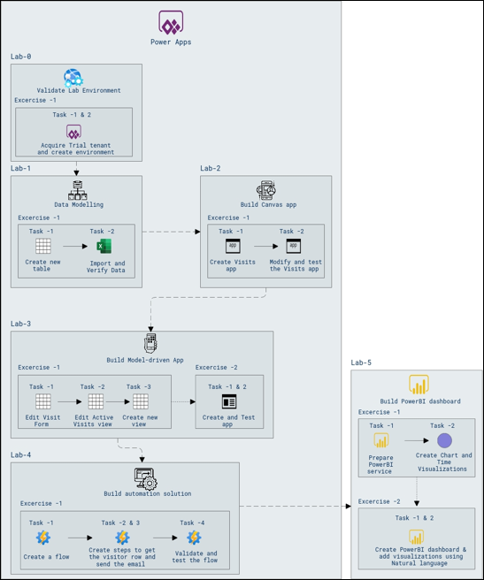

# Lab Scenario Preview: PL-900: Microsoft Power Platform Fundamentals

### Lab overview

In this lab, you will learn Microsoft Power Platform Fundamentals is a suite of low-code tools that empower users to create business applications, automate processes, and analyze data without extensive coding knowledge. It consists of Power Apps, Power Automate, and Power BI, enabling users to build, automate, and visualize solutions efficiently.

## Objective
  
After completing this lab, you will be able to:

- Create a data model.
- Build a Canvas app.
- Build a Power Apps model-driven app.
- Create a Power Automate flow.
- Build a Power BI report and dashboard that visualizes data.

## Architecture Diagram

 
